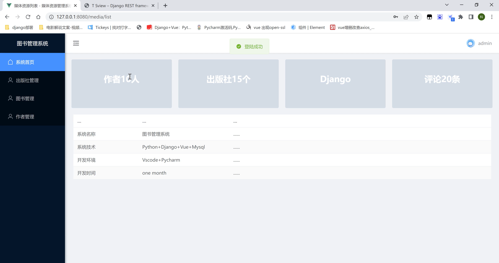
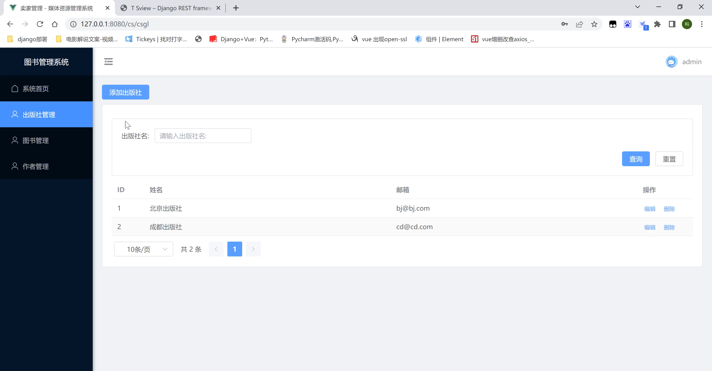
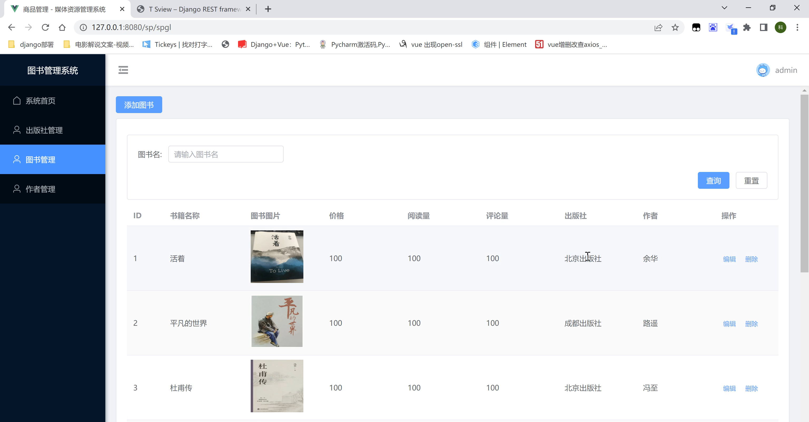
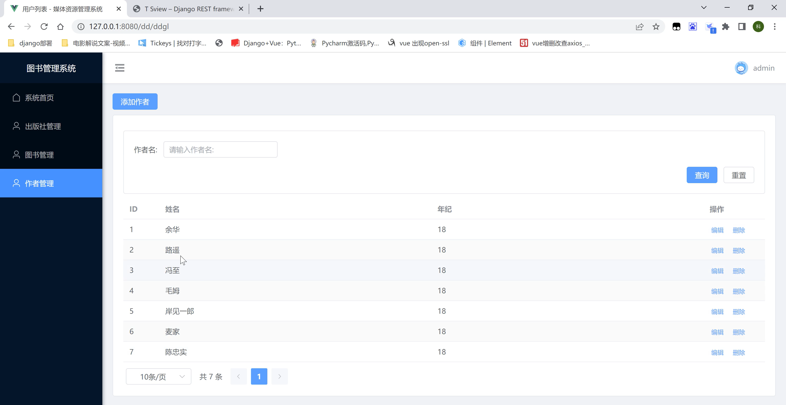

# Python+Django+Vue图书管理系统开发全流程

大家好，我是程序员科科，这是我开源的基于Python+Django+Vue的图书管理系统

希望可以帮助想学前后端分离的同学

项目中遇到问题欢迎添加微信python_kk一起探讨

如果感觉项目还不错，请帮我点个star~


项目运行截图

首页



出版社




图书




作者




怎么运行项目

前端

npm install

npm run dev


后端

使用虚拟环境

python manage.py runserver 127.0.0.1:8000


前端8080端口，后端8000端口


1、pycharm创建django项目（使用虚拟环境，避免项目干扰）


2、配置总路由

```python
from django.urls import path,re_path,include
from django_vue_tushu.settings import MEDIA_ROOT
from django.contrib import admin
from dvtushu import views
from django.views.static import serve
from rest_framework.documentation import include_docs_urls

urlpatterns = [
    # 接口文档
    path('docs/', include_docs_urls(title='tushu')),
    path('admin/', admin.site.urls),
    path('django_vue_tushu/', include('dvtushu.urls'),name='dvtushu'),
    # 图片上传接口
    re_path('img_upload/', views.img_uploadApiview.as_view()),
    # 前端查找图片地址
    re_path('upimg/(?P<path>.*)', serve, {"document_root": MEDIA_ROOT})
]
```


3、配置子路由

```python
from django.urls import path,re_path
from . import views

urlpatterns = [
    # path('/', ),
]
```


3、启动项目

python manage.py runserver 127.0.0.1 或者 pycharm 启动


4、安装依赖（有默认前后端分离所需依赖）

pip install -r .\utils\requ.txt -i https://pypi.tuna.tsinghua.edu.cn/simple


依赖放入 /utils/requirements.txt

```python
asgiref==3.7.2
certifi==2024.2.2
cffi==1.15.1
charset-normalizer==3.3.2
coreapi==2.3.3
coreschema==0.0.4
cryptography==42.0.2
Django==3.2.23
django-cors-headers==4.1.0
django-filter==23.5
django-rest-swagger==2.2.0
djangorestframework==3.14.0
djangorestframework-jwt==1.11.0
drf-yasg==1.21.7
idna==3.6
inflection==0.5.1
install==1.3.5
itypes==1.2.0
Jinja2==3.1.3
MarkupSafe==2.1.5
openapi-codec==1.3.2
packaging==24.0
pycparser==2.21
PyJWT==1.7.1
PyMySQL==1.1.0
pytz==2023.4
PyYAML==6.0.1
requests==2.31.0
simplejson==3.19.2
sqlparse==0.4.4
typing_extensions==4.7.1
uritemplate==4.1.1
urllib3==1.26.12
```


5、修改数据库


djvue_school_shop/settings.py

```python
DATABASES = {
    "default": {
        "ENGINE": "django.db.backends.mysql",
        "HOST": "127.0.0.1",
        "PORT": 3306,
        "USER": "root",
        "PASSWORD": "123456",
        "NAME": "dvlvyou",
    }
}
```


djvue_school_shop/__init__.py

```python
import pymysql
pymysql.install_as_MySQLdb()
```


6、设置settings相关内容


（1）：添加跨域和djangorestframework

```python
INSTALLED_APPS = [
    'django.contrib.admin',
    'django.contrib.auth',
    'django.contrib.contenttypes',
    'django.contrib.sessions',
    'django.contrib.messages',
    'django.contrib.staticfiles',
    'djvue_schoolshop.apps.DjvueSchoolshopConfig',
    'corsheaders',
    'rest_framework',
]
```


（2）：添加跨域中间件和注释csrf

```python
MIDDLEWARE = [
    'django.middleware.security.SecurityMiddleware',
    'django.contrib.sessions.middleware.SessionMiddleware',
    'django.middleware.common.CommonMiddleware',
    # 'django.middleware.csrf.CsrfViewMiddleware',
    'django.contrib.auth.middleware.AuthenticationMiddleware',
    'django.contrib.messages.middleware.MessageMiddleware',
    'django.middleware.clickjacking.XFrameOptionsMiddleware',
    'corsheaders.middleware.CorsMiddleware',
]
```


（3）：时间中国

```python
LANGUAGE_CODE = 'zh-Hans'

TIME_ZONE = 'Asia/Shanghai'
```


（4）：添加跨域请求头和请求地址相关

```python
# # # CORS组的配置信息
# CORS_ORIGIN_WHITELIST = (
#     #'www.hippo.cn:8080', #如果这样写不行的话，就加上协议(http://www.hippo.cn:8080，因为不同的corsheaders版本可能有不同的要求)
#     'http://127.0.0.1:8080',
# )
CORS_ORIGIN_ALLOW_ALL = True

# 是否允许ajax跨域请求时携带cookie，False表示不用，我们后面也用不到cookie，所以关掉它就可以了，以防有人通过cookie来搞我们的网站
CORS_ALLOW_CREDENTIALS = False
# 请求方法
CORS_ALLOW_METHODS = (
    'DELETE',
    'GET',
    'OPTIONS',
    'PATCH',
    'POST',
    'PUT',
    'VIEW',
)
# 允许的请求头，不能用*，要写具体的请求头，不然Vue会跨域失败，在这里坑了我好久好久MD
CORS_ALLOW_HEADERS = (
'*'
)
```


（5）：添加djangorestframework全局处理类

```python
REST_FRAMEWORK = {
    # 异常处理
    # 'EXCEPTION_HANDLER': 'hippo_api.utils.exceptions.custom_exception_handler',

    # jwt
    'DEFAULT_AUTHENTICATION_CLASSES': (
        # 'rest_framework_jwt.authentication.JSONWebTokenAuthentication',
        'rest_framework.authentication.SessionAuthentication',
        'rest_framework.authentication.BasicAuthentication',
        # 'dj_vue_jc.TokenAuthtication.TokenAuthtication',
    ),
}
```


（6）：添加媒体上传文件配置

```python
# 指定文件获取的url路径
MEDIA_URL = "/upimg/"

# 文件上传的保存路径
MEDIA_ROOT = BASE_DIR / 'upimg'
```


7、创建媒体文件

```python
upimg
```


8、urls中设置前端文件图片上传地址和访问地址

```python
from django.urls import path,re_path,include
from django_vue_tushu.settings import MEDIA_ROOT
from django.contrib import admin
from dvtushu import views
from django.views.static import serve
from rest_framework.documentation import include_docs_urls

urlpatterns = [
    # 接口文档
    path('docs/', include_docs_urls(title='tushu')),
    path('admin/', admin.site.urls),
    path('django_vue_tushu/', include('dvtushu.urls'),name='dvtushu'),
    # 图片上传接口
    re_path('img_upload/', views.img_uploadApiview.as_view()),
    # 前端查找图片地址
    re_path('upimg/(?P<path>.*)', serve, {"document_root": MEDIA_ROOT})
]
```


9、views 设置 图片上传接口

```python
# 前台返回格式
ret = {
    "data": {},
    "meta": {
        "status": 200,
        "message": "注册成功"
    }
}

# 图片上传接口
class img_uploadApiview(View):
    def get(self, request):
        return JsonResponse(data={'code': 200, 'message': '方法测试'})

    # 图片上传接口通过 request.data 可以接收到前端发来的
    def post(self,request):
        response = {}
        dataduixiang = request.POST.get('data','')
        file = request.FILES.get('file')
        # try:
        # 构造图片保存路径 路径为<USER_AVATAR_ROOT + 文件名>
        # USER_AVATAR_ROOT刚刚在settings.py中规定过，需要导入进来
        file_path = os.path.join(settings.MEDIA_ROOT, file.name)
        # 保存图片
        print(dataduixiang,file)
        with open(file_path, 'wb+') as f:
            f.write(file.read())
            f.close()
        response['file'] = file.name  # 返回新的文件名
        response['code'] = 0
        response['msg'] = "图片上传成功！"
        return JsonResponse(data={'code': 200, 'message': '上传成功', 'data': response})
```


10、启动项目

python manage.py runserver 127.0.0.1:8000


11、数据库设计

```python
from django.db import models

# Create your models here.

# 管理表
class Guanli(models.Model):
    username = models.CharField(max_length=255)
    password = models.TextField()

from django.db import models

# Create your models here.


class Book(models.Model):
    title = models.CharField(max_length=32, verbose_name="书籍名称")
    price = models.IntegerField(verbose_name="价格")
    # pub_date = models.DateField(verbose_name="出版日期")
    img_url = models.CharField(max_length=255, null=True,blank=True,verbose_name="")
    bread = models.IntegerField(verbose_name="阅读量")
    bcomment = models.IntegerField(verbose_name="评论量")
    publish = models.ForeignKey("Publish", on_delete=models.CASCADE, verbose_name="出版社")
    authors = models.ManyToManyField("Author",verbose_name="作者")

    def __str__(self):
        return self.title


class Publish(models.Model):
    name = models.CharField(max_length=32, verbose_name="出版社名称")
    email = models.EmailField(verbose_name="出版社邮箱")

    def __str__(self):
        return self.name


class Author(models.Model):
    name = models.CharField(max_length=32, verbose_name="作者")
    age = models.IntegerField(verbose_name="年龄")

    def __str__(self):
        return self.name
```


12、迁移

```python
python manage.py makemigrations

python manage.py migrate
```


13、登录接口

url

```python
# 登录接口
path('logintest/', views.LoginView.as_view()),
```

view

```python
from .TokenAuthtication import TokenAuthtication
from rest_framework.response import Response
from django.core.paginator import Paginator
from rest_framework.views import APIView
from django.views import View
from django.http import HttpResponse,JsonResponse
from django_vue_tushu import settings
from .Serializer import *
from .models import *
import datetime
import jwt
import os

class LoginView(APIView):
    def post(self, request):
        ret = {
            "data": {},
            "meta": {
                "status": 200,
                "message": ""
            }
        }
        try:
            username = request.data["username"]
            password = request.data["password"]
            value = int(request.data["value"])

            if value == 1:
                user = Guanli.objects.filter(username=username,password=password)
                print(username,password,value,user)
                if user.count == 0:
                    ret["meta"]["status"] = 500
                    ret["meta"]["message"] = "用户不存在或密码错误"
                    return Response(ret)
                elif user and user.first().password:
                    dict = {
                        "exp": datetime.datetime.now() + datetime.timedelta(days=1),  # 过期时间
                        "iat": datetime.datetime.now(),  # 开始时间
                        "id": user.first().id,
                        "username": user.first().username,
                    }
                    token = jwt.encode(dict, settings.SECRET_KEY, algorithm="HS256")
                    ret["data"]["token"] = token
                    ret["data"]["username"] = user.first().username
                    ret["data"]["user_id"] = user.first().id
                    # 这里需要根据数据库判断是不是管理员
                    ret["data"]["isAdmin"] = 1
                    ret["meta"]["status"] = 200
                    ret["meta"]["message"] = "登录成功"
                    print(ret,type(ret))
                    return Response(ret)
                else:
                    ret["meta"]["status"] = 500
                    ret["meta"]["message"] = "用户不存在或密码错误"
                    return Response(ret)
        except Exception as error:
            print(error)
            ret["meta"]["status"] = 500
            ret["meta"]["message"] = "用户不存在或密码错误"
            return Response(ret)
```


14、创建Serializer

djvue_schoolshop

```python
from rest_framework import serializers
from rest_framework.serializers import ModelSerializer
from . import models

class GuanliModelSerializers(ModelSerializer):
    """管理员信息模型序列化器"""
    username = serializers.CharField(read_only=True)

    class Meta:
        model = models.Guanli
        fields = '__all__'

class PublishSerializer(serializers.ModelSerializer):
    class Meta:
        model=models.Publish
        fields = "__all__"

class AuthorSerializer(serializers.ModelSerializer):
    class Meta:
        model=models.Author
        fields = "__all__"

class BookInfoModelSerializermodel(serializers.ModelSerializer):
    # 使用PublishSerializer作为publish字段的嵌套序列化器
    publish = PublishSerializer(read_only=True)
    # 使用主键字段类型 并且将publish_id设置为"只写"，也就是读取的时候不会返回！
    publish_id = serializers.PrimaryKeyRelatedField(queryset=models.Publish.objects.all(), source='publish',
                                                    write_only=True)

    # 使用AuthorSerializer作为author字段的嵌套序列化器
    authors = AuthorSerializer(read_only=True, many=True)
    # 使用主键字段类型 并且将author_id设置为"只写"，也就是读取的时候不会返回！
    authors_id = serializers.PrimaryKeyRelatedField(queryset=models.Author.objects.all(), source='authors',
                                                    write_only=True, many=True)

    class Meta:
        model = models.Book
        # fields = ['id', 'title', 'price', 'pub_date', 'bread', 'bcomment', 'publish_id', 'publish', 'authors',
        #           'authors_id']
        fields = "__all__"
        # depth = 1
```


15、图书接口

url

```python
# 图书管理
path('ts/', views.TSview.as_view()),
re_path('ts/(?P<pk>\d+)/', views.Tsdetailview.as_view()),
```

view

```python
class TSview(APIView):
    # 单个禁用 token 验证
    authentication_classes = [TokenAuthtication]

    def get(self, request):
        # 获取数据集（学生模型对象）
        students_data = Book.objects.all()
        pageNum = request.GET.get('pageNum', '')
        pageSize = request.GET.get('pageSize', '')
        # 过滤
        search_nick_term = request.GET.get('title', '')
        if search_nick_term:
            search_nick_term = search_nick_term.strip()
            students_data = students_data.filter(title__icontains=search_nick_term)
        # 自定义分页 过滤后再次分页
        paginator = Paginator(students_data, pageSize)
        page_obj = paginator.get_page(pageNum)
        # 拿到分页对象
        page_obj_dq = page_obj.object_list
        # 拿到总数
        page_obj_zs = paginator.count
        # 实例化序列化器，得到序列化器对象
        # 分页对象进行序列化
        ser = BookInfoModelSerializermodel(instance=page_obj_dq, many=True)
        # 调用序列化器对象的data属性方法获取转换后的数据
        data = ser.data

        # 响应数据
        return Response(data={'code': 200, 'zs': page_obj_zs, 'data': data})

    def post(self, request):
        print(request.data)
        # 反序列化数据
        student = BookInfoModelSerializermodel(data=request.data)
        # 校验不通过
        if not student.is_valid():
            # 返回错误信息
            return Response(data={'code': 500, 'data': student.errors})
        # 校验通过，保存数据
        student.save()
        # 响应数据
        return Response(data={'code': 200, 'message': '增加成功', 'data': student.data})
class Tsdetailview(APIView):
    authentication_classes = [TokenAuthtication]

    def get(self, request, pk):
        student = Book.objects.get(pk=pk)
        ser = BookInfoModelSerializermodel(instance=student)
        return Response(ser.data)

    # 修改一个学生的信息
    def put(self, request, pk):
        print(request.data)
        instance = Book.objects.get(pk=pk)
        ser = BookInfoModelSerializermodel(instance=instance, data=request.data)
        if not ser.is_valid():
            return Response(data={'code': 500, 'message': ser.errors})
        ser.save()
        return Response(data={'code': 200, 'message': '修改成功', 'data': ser.data})

    # 删除一个学生的信息
    def delete(self, request, pk):
        Book.objects.get(pk=pk).delete()
        return Response(data={'code': 200, 'message': '删除成功'})
```


16、出版社管理

```python
# 出版社管理
path('cbs/', views.Cbsview.as_view()),
re_path('cbs/(?P<pk>\d+)/', views.Cbsdetailview.as_view()),
```

```python
class Cbsview(APIView):
    # 单个禁用 token 验证
    authentication_classes = [TokenAuthtication]

    def get(self, request):
        # 获取数据集（学生模型对象）
        students_data = Publish.objects.all()
        pageNum = request.GET.get('pageNum', '')
        pageSize = request.GET.get('pageSize', '')
        # 过滤
        search_nick_term = request.GET.get('name', '')
        if search_nick_term:
            search_nick_term = search_nick_term.strip()
            students_data = students_data.filter(name__icontains=search_nick_term)
        # 自定义分页 过滤后再次分页
        paginator = Paginator(students_data, pageSize)
        page_obj = paginator.get_page(pageNum)
        # 拿到分页对象
        page_obj_dq = page_obj.object_list
        # 拿到总数
        page_obj_zs = paginator.count
        # 实例化序列化器，得到序列化器对象
        # 分页对象进行序列化
        ser = PublishSerializer(instance=page_obj_dq, many=True)
        # 调用序列化器对象的data属性方法获取转换后的数据
        data = ser.data

        # 响应数据
        return Response(data={'code': 200, 'zs': page_obj_zs, 'data': data})

    def post(self, request):
        print(request.data)
        # 反序列化数据
        student = PublishSerializer(data=request.data)
        # 校验不通过
        if not student.is_valid():
            # 返回错误信息
            return Response(data={'code': 500, 'data': student.errors})
        # 校验通过，保存数据
        student.save()
        # 响应数据
        return Response(data={'code': 200, 'message': '增加成功', 'data': student.data})
class Cbsdetailview(APIView):
    authentication_classes = [TokenAuthtication]

    def get(self, request, pk):
        student = Publish.objects.get(pk=pk)
        ser = PublishSerializer(instance=student)
        return Response(ser.data)

    # 修改一个学生的信息
    def put(self, request, pk):
        print(request.data)
        instance = Publish.objects.get(pk=pk)
        ser = PublishSerializer(instance=instance, data=request.data)
        if not ser.is_valid():
            return Response(data={'code': 500, 'message': ser.errors})
        ser.save()
        return Response(data={'code': 200, 'message': '修改成功', 'data': ser.data})

    # 删除一个学生的信息
    def delete(self, request, pk):
        Publish.objects.get(pk=pk).delete()
        return Response(data={'code': 200, 'message': '删除成功'})
```


17、作者

```python
# 作者管理
path('zz/', views.Zzview.as_view()),
re_path('zz/(?P<pk>\d+)/', views.Zzdetailview.as_view()),
```

```python
class Zzview(APIView):
    # 单个禁用 token 验证
    authentication_classes = [TokenAuthtication]

    def get(self, request):
        # 获取数据集（学生模型对象）
        students_data = Author.objects.all()
        pageNum = request.GET.get('pageNum', '')
        pageSize = request.GET.get('pageSize', '')
        # 过滤
        search_nick_term = request.GET.get('name', '')
        if search_nick_term:
            search_nick_term = search_nick_term.strip()
            students_data = students_data.filter(name__icontains=search_nick_term)
        # 自定义分页 过滤后再次分页
        paginator = Paginator(students_data, pageSize)
        page_obj = paginator.get_page(pageNum)
        # 拿到分页对象
        page_obj_dq = page_obj.object_list
        # 拿到总数
        page_obj_zs = paginator.count
        # 实例化序列化器，得到序列化器对象
        # 分页对象进行序列化
        ser = AuthorSerializer(instance=page_obj_dq, many=True)
        # 调用序列化器对象的data属性方法获取转换后的数据
        data = ser.data

        # 响应数据
        return Response(data={'code': 200, 'zs': page_obj_zs, 'data': data})

    def post(self, request):
        print(request.data)
        # 反序列化数据
        student = AuthorSerializer(data=request.data)
        # 校验不通过
        if not student.is_valid():
            # 返回错误信息
            return Response(data={'code': 500, 'data': student.errors})
        # 校验通过，保存数据
        student.save()
        # 响应数据
        return Response(data={'code': 200, 'message': '增加成功', 'data': student.data})
class Zzdetailview(APIView):
    authentication_classes = [TokenAuthtication]

    def get(self, request, pk):
        student = Author.objects.get(pk=pk)
        ser = AuthorSerializer(instance=student)
        return Response(ser.data)

    # 修改一个学生的信息
    def put(self, request, pk):
        print(request.data)
        instance = Author.objects.get(pk=pk)
        ser = AuthorSerializer(instance=instance, data=request.data)
        if not ser.is_valid():
            return Response(data={'code': 500, 'message': ser.errors})
        ser.save()
        return Response(data={'code': 200, 'message': '修改成功', 'data': ser.data})

    # 删除一个学生的信息
    def delete(self, request, pk):
        Author.objects.get(pk=pk).delete()
        return Response(data={'code': 200, 'message': '删除成功'})
```